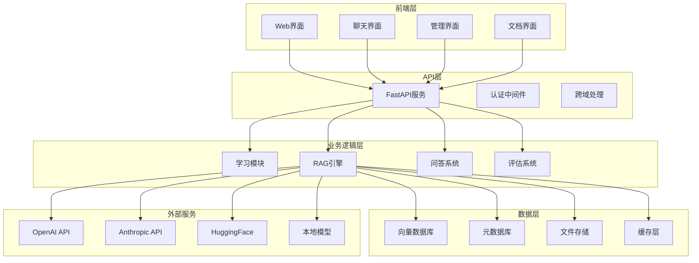

# LangChain RAG学习项目设计文档

## 概述

本项目采用模块化架构设计，构建一个全面的LangChain和RAG学习平台。系统分为学习模块、核心RAG引擎、Web界面和评估工具四个主要部分，支持从理论学习到实践应用的完整学习路径。

## 架构设计

### 整体架构



### 技术栈选择

**后端框架:**
- FastAPI: 高性能异步API框架，支持自动文档生成
- LangChain: 核心LLM应用框架
- Pydantic: 数据验证和序列化

**向量数据库:**
- Chroma: 轻量级向量数据库，适合学习和开发
- FAISS: 高性能向量检索库
- Qdrant: 生产级向量数据库选项

**前端技术:**
- Streamlit: 快速原型和学习界面
- React + TypeScript: 生产级Web界面
- Tailwind CSS: 现代化样式框架

**LLM集成:**
- OpenAI GPT系列
- Anthropic Claude
- HuggingFace Transformers
- Ollama本地模型

## 组件和接口设计

### 1. 学习模块 (Learning Module)

```python
class LearningModule:
    """学习模块核心类"""
    
    def __init__(self):
        self.theory_content = TheoryContentManager()
        self.tutorial_engine = TutorialEngine()
        self.progress_tracker = ProgressTracker()
    
    async def get_learning_path(self, user_level: str) -> LearningPath:
        """获取个性化学习路径"""
        pass
    
    async def get_theory_content(self, topic: str) -> TheoryContent:
        """获取理论内容"""
        pass
    
    async def get_tutorial(self, tutorial_id: str) -> Tutorial:
        """获取实践教程"""
        pass

class TheoryContent(BaseModel):
    """理论内容数据模型"""
    topic: str
    level: str
    content: str
    examples: List[str]
    references: List[str]
    next_topics: List[str]
```

### 2. RAG引擎 (RAG Engine)

```python
class RAGEngine:
    """RAG引擎核心类"""
    
    def __init__(self):
        self.document_processor = DocumentProcessor()
        self.vector_store = VectorStoreManager()
        self.retriever = HybridRetriever()
        self.llm_manager = LLMManager()
        self.reranker = Reranker()
    
    async def ingest_documents(self, documents: List[Document]) -> IngestResult:
        """文档摄取和索引"""
        pass
    
    async def query(self, query: str, context: Optional[str] = None) -> RAGResponse:
        """执行RAG查询"""
        pass
    
    async def get_similar_documents(self, query: str, k: int = 5) -> List[Document]:
        """获取相似文档"""
        pass

class RAGResponse(BaseModel):
    """RAG响应数据模型"""
    answer: str
    sources: List[DocumentChunk]
    confidence: float
    retrieval_time: float
    generation_time: float
    metadata: Dict[str, Any]
```

### 3. 文档处理器 (Document Processor)

```python
class DocumentProcessor:
    """文档处理器"""
    
    def __init__(self):
        self.text_splitter = RecursiveCharacterTextSplitter()
        self.embeddings = EmbeddingManager()
        self.metadata_extractor = MetadataExtractor()
    
    async def process_document(self, file_path: str) -> List[DocumentChunk]:
        """处理单个文档"""
        pass
    
    async def extract_text(self, file_path: str, file_type: str) -> str:
        """提取文档文本"""
        pass
    
    async def chunk_document(self, text: str, metadata: Dict) -> List[DocumentChunk]:
        """文档分块"""
        pass

class DocumentChunk(BaseModel):
    """文档块数据模型"""
    content: str
    metadata: Dict[str, Any]
    embedding: Optional[List[float]]
    chunk_id: str
    source_document: str
    chunk_index: int
```

### 4. 混合检索器 (Hybrid Retriever)

```python
class HybridRetriever:
    """混合检索器，结合密集和稀疏检索"""
    
    def __init__(self):
        self.dense_retriever = DenseRetriever()
        self.sparse_retriever = SparseRetriever()
        self.fusion_ranker = FusionRanker()
    
    async def retrieve(self, query: str, k: int = 10) -> List[DocumentChunk]:
        """混合检索"""
        dense_results = await self.dense_retriever.retrieve(query, k)
        sparse_results = await self.sparse_retriever.retrieve(query, k)
        return await self.fusion_ranker.fuse_results(dense_results, sparse_results)
    
    async def rerank_results(self, query: str, results: List[DocumentChunk]) -> List[DocumentChunk]:
        """重排序结果"""
        pass
```

### 5. LLM管理器 (LLM Manager)

```python
class LLMManager:
    """LLM管理器，支持多种模型提供商"""
    
    def __init__(self):
        self.providers = {
            "openai": OpenAIProvider(),
            "anthropic": AnthropicProvider(),
            "huggingface": HuggingFaceProvider(),
            "local": LocalModelProvider()
        }
        self.current_provider = "openai"
    
    async def generate_response(self, prompt: str, context: List[str]) -> LLMResponse:
        """生成回答"""
        pass
    
    async def switch_provider(self, provider_name: str) -> bool:
        """切换模型提供商"""
        pass
    
    async def get_available_models(self) -> Dict[str, List[str]]:
        """获取可用模型列表"""
        pass
```

## 数据模型设计

### 核心数据模型

```python
class User(BaseModel):
    """用户模型"""
    user_id: str
    username: str
    email: str
    learning_level: str
    progress: Dict[str, float]
    preferences: Dict[str, Any]
    created_at: datetime
    last_active: datetime

class KnowledgeBase(BaseModel):
    """知识库模型"""
    kb_id: str
    name: str
    description: str
    document_count: int
    total_chunks: int
    embedding_model: str
    created_at: datetime
    updated_at: datetime

class QuerySession(BaseModel):
    """查询会话模型"""
    session_id: str
    user_id: str
    kb_id: str
    queries: List[Query]
    created_at: datetime
    updated_at: datetime

class Query(BaseModel):
    """查询模型"""
    query_id: str
    question: str
    answer: str
    sources: List[str]
    feedback: Optional[int]
    response_time: float
    timestamp: datetime
```

## 错误处理策略

### 1. 分层错误处理

```python
class RAGException(Exception):
    """RAG系统基础异常"""
    pass

class DocumentProcessingError(RAGException):
    """文档处理错误"""
    pass

class RetrievalError(RAGException):
    """检索错误"""
    pass

class LLMError(RAGException):
    """LLM调用错误"""
    pass

class VectorStoreError(RAGException):
    """向量存储错误"""
    pass
```

### 2. 错误恢复机制

- **重试机制**: 对于临时性错误（网络超时、API限流）实现指数退避重试
- **降级策略**: LLM服务不可用时切换到备用提供商
- **缓存机制**: 缓存常见查询结果，减少外部依赖
- **监控告警**: 实时监控系统健康状态，及时发现问题

### 3. 用户友好的错误提示

```python
ERROR_MESSAGES = {
    "document_upload_failed": "文档上传失败，请检查文件格式和大小",
    "retrieval_timeout": "检索超时，请稍后重试",
    "llm_quota_exceeded": "API配额已用完，请稍后重试或切换模型",
    "invalid_query": "查询格式不正确，请重新输入"
}
```

## 测试策略

### 1. 单元测试

- **组件测试**: 每个核心组件的独立功能测试
- **模拟测试**: 使用Mock对象测试外部依赖
- **边界测试**: 测试极端情况和边界条件

### 2. 集成测试

- **端到端测试**: 完整的RAG流程测试
- **API测试**: REST API接口测试
- **数据库测试**: 数据持久化和查询测试

### 3. 性能测试

- **负载测试**: 并发查询性能测试
- **压力测试**: 系统极限性能测试
- **基准测试**: 不同配置下的性能对比

### 4. 质量评估

```python
class RAGEvaluator:
    """RAG系统质量评估器"""
    
    def __init__(self):
        self.metrics = {
            "retrieval_precision": RetrievalPrecision(),
            "retrieval_recall": RetrievalRecall(),
            "answer_relevance": AnswerRelevance(),
            "answer_faithfulness": AnswerFaithfulness(),
            "context_precision": ContextPrecision()
        }
    
    async def evaluate_rag_pipeline(self, test_dataset: List[TestCase]) -> EvaluationResult:
        """评估RAG管道性能"""
        pass
    
    async def generate_evaluation_report(self, results: EvaluationResult) -> str:
        """生成评估报告"""
        pass
```

## 部署和扩展性设计

### 1. 容器化部署

```dockerfile
# 多阶段构建，优化镜像大小
FROM python:3.11-slim as builder
# 构建阶段...

FROM python:3.11-slim as runtime
# 运行时阶段...
```

### 2. 微服务架构

- **API服务**: 处理HTTP请求
- **RAG服务**: 核心RAG逻辑
- **文档处理服务**: 异步文档处理
- **向量服务**: 向量存储和检索

### 3. 水平扩展支持

- **负载均衡**: 支持多实例部署
- **缓存层**: Redis缓存热点数据
- **异步处理**: Celery任务队列处理耗时操作
- **数据库分片**: 支持大规模数据存储

### 4. 监控和日志

```python
class SystemMonitor:
    """系统监控"""
    
    def __init__(self):
        self.metrics_collector = MetricsCollector()
        self.logger = StructuredLogger()
    
    async def track_query_performance(self, query_id: str, metrics: Dict):
        """跟踪查询性能"""
        pass
    
    async def log_system_event(self, event_type: str, details: Dict):
        """记录系统事件"""
        pass
```

## 安全性设计

### 1. 数据安全

- **输入验证**: 严格的输入参数验证
- **SQL注入防护**: 使用参数化查询
- **文件上传安全**: 文件类型和大小限制
- **敏感信息过滤**: 自动检测和过滤敏感内容

### 2. API安全

- **认证授权**: JWT token认证
- **访问控制**: 基于角色的权限管理
- **速率限制**: 防止API滥用
- **HTTPS强制**: 所有通信加密传输

### 3. 隐私保护

- **数据匿名化**: 用户数据匿名处理
- **本地部署选项**: 支持完全本地化部署
- **数据清理**: 定期清理过期数据
- **审计日志**: 完整的操作审计记录